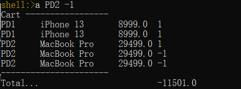

# POS in Shell

The demo shows a simple POS system with command line interface. 

To run

```shell
mvn clean spring-boot:run
```

Currently, it implements three commands which you can see using the `help` command.

```shell
  .   ____          _            __ _ _
 /\\ / ___'_ __ _ _(_)_ __  __ _ \ \ \ \
( ( )\___ | '_ | '_| | '_ \/ _` | \ \ \ \
 \\/  ___)| |_)| | | | | || (_| |  ) ) ) )
  '  |____| .__|_| |_|_| |_\__, | / / / /
 =========|_|==============|___/=/_/_/_/
 :: Spring Boot ::                (v2.5.7)
 
shell:>help
AVAILABLE COMMANDS

Built-In Commands
        clear: Clear the shell screen.
        exit, quit: Exit the shell.
        help: Display help about available commands.
        history: Display or save the history of previously run commands
        script: Read and execute commands from a file.
        stacktrace: Display the full stacktrace of the last error.

Pos Command
        a: Add a Product to Cart
        n: New Cart
        p: List Products
```

Everytime a customer come to make a purchase, use `n` to create a new cart and then use `a ${productid} ${amount}` to add a product to the cart.

Please make the POS system robust and fully functional by implementing more commands, for instance, print/empty/modify cart.

Implementing a PosDB with real database is very much welcome. 

Please use asciinema (https://asciinema.org) to record a demo and submit the url in QQ group. 

And please elaborate your understanding in layered systems via this homework in your README.md.


### 实验内容

1.目前已有的功能中存在问题的是a: Add a Product to Cart，问题是在对同一类商品的操作不能合并，并且会出现总金额为负数的情况，如下图所示



 对这种问题进行了修改，在计算总金额的过程中合并同类项。

2.对于是否初始化Cart，增加了一个判断的指令c: Check Cart

3.直接对Cart中已有的商品的数量进行修改，增加了一个指令m: Modify Cart


### 实验中遇到的问题

1.配置环境变量，ide的maven的构建参考了https://blog.csdn.net/qq_54769967/article/details/121162589

2.在wsl上安装maven时遇到了错误returned error exit status 134，参考了https://askubuntu.com/questions/1160366/apt-not-working-installed-libc-bin-package-post-installation-script-subprocess


### 实验的收获

1.首先是学习了软件的层次化结构，在这个实验中几个模块都分得很清楚，方便了阅读代码和对代码进行修改。

2.学习了Java的两个数据结构 ArrayList 和 StringBuffer，参考了菜鸟教程。
